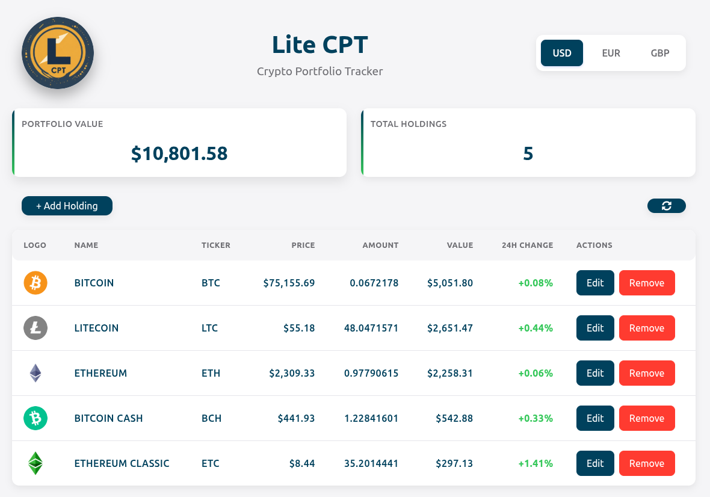

# LiteCPT

A simple, responsive electron app to track your cryptocurrency holdings in real-time. Add, remove, and search for coins, and view your portfolio value in different currencies.

---

## Features

- View your crypto portfolio with live prices fetched using the CoinGecko API
- Add and remove coins easily
- Edit your holdings
- Search for coins by name or ticker
- Display portfolio value in USD, EUR and GBP
- Responsive UI with modern design
- Persistent portfolio data

---

## UI Preview

<p align="center">
  
</p>

---

## Tech Stack

- **Frontend:**
  - React 19
  - Vite
  - CSS Modules
- **Backend:**
  - Python (FastAPI, Uvicorn)
- **Cryptocurrency API:**
  - CoinGecko
- **Desktop Application:**
  - Electron
  - Node.js

---

## Requirements

- **Python 3.10+**
- Python dependencies listed in requirements.txt
- **Node.js 20+** and npm (for Electron app and React)

---

## Installation

1. Clone the repository:

```bash
git clone <your-repo-url>
```
2. Create a virtual Python environment named .venv in the root directory: (required)

```bash
python3 -m venv .venv
```

3. Install Python dependencies:

```bash
pip install -r requirements.txt
```

4. Set up the Electron App in the root directory:

```bash
npm install
```

5. Build the frontend:

```bash
cd frontend
npm install
npm run build
cd ..
```

---

## Usage

To run the application as a standalone Electron desktop app from the root directory:

```bash
npm start
```

The launcher will:

- Launch the FastAPI backend (uvicorn).
- Open the Electron desktop window.
- Automatically handle backend startup, waiting for readiness, and shutdown when the window is closed.

---

## License

**LiteCPT** © [Thomas Edward Ash](https://github.com/T-Ash-90). This project is licensed under the MIT License

---

## Troubleshooting

If you encounter any issues:

- Make sure all dependencies are installed correctly
- Check that the Python virtual environment is activated
- Ensure ports 8010 (backend) and 5173 (frontend) are available
- Check the console for error messages in both the Electron and terminal windows

For rate limiting issues with the CoinGecko API, please note that the free tier has limitations and may be subject to change.
